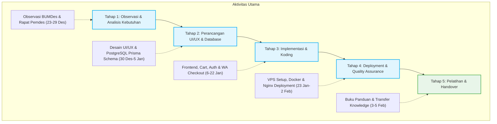

# UCAPAN TERIMA KASIH

Puji syukur ke hadirat Allah SWT atas rahmat dan karunia-Nya sehingga program kerja individu KKN Tematik Inovasi Daerah Gelombang 115 Universitas Hasanuddin yang berjudul **"Pengembangan Website Landing Page BUMDes Kalosi"** dapat diselesaikan dengan baik. 

Penulis menyadari bahwa keberhasilan program kerja ini tidak lepas dari bimbingan, arahan, bantuan, serta dukungan dari berbagai pihak. Oleh karena itu, dengan segala ketulusan hati, penulis menyampaikan ucapan terima kasih yang sebesar-besarnya kepada:

1. **Kedua Orang Tua dan Keluarga Tercinta**, yang senantiasa memberikan doa restu, kasih sayang, serta dukungan moral dan material yang tak terhingga sepanjang pelaksanaan KKN ini.
2. **Rektor Universitas Hasanuddin beserta jajaran pengelola UPT KKN Unhas**, yang telah memfasilitasi dan memberikan kesempatan bagi penulis untuk mengabdi kepada masyarakat.
3. **Ibu Anggun Permata Sari, S. Pt., M. Pt.** selaku Dosen Pembimbing KKN (DPK) Desa Kalosi, atas kesabaran, bimbingan, arahan, dan motivasi yang diberikan sejak pembekalan hingga berakhirnya masa KKN.
4. **Bapak Kepala Desa Kalosi beserta seluruh jajaran Perangkat Pemerintah Desa Kalosi**, Kecamatan Dua Pitue, Kabupaten Sidenreng Rappang, atas izin, penerimaan yang hangat, serta fasilitas kemudahan yang diberikan kepada penulis selama tinggal di lokasi KKN.
5. **Bapak Sekretaris Desa (Sekdes) Kalosi**, atas bantuan koordinasi yang luar biasa, keterbukaan informasi, masukan berharga, serta arahannya dalam menyempurnakan fitur-fitur website BUMDes Kalosi.
6. **Direktur dan Seluruh Staf Pengelola BUMDes "Sumber Kalosi"**, yang telah bersedia meluangkan waktu untuk berdiskusi, membantu menyediakan data-data unit usaha, serta berpartisipasi aktif dalam sesi pelatihan penggunaan website.
7. **Rekan-rekan Mahasiswa Posko KKN Unhas Gelombang 115 Desa Kalosi** (khususnya Theo, Dwigita Nanda Aulyah, dan rekan-rekan seperjuangan lainnya), atas kebersamaan, kerja sama tim, kebahagiaan, bantuan tenaga, serta persaudaraan erat yang terjalin selama 50 hari di posko KKN.
8. **Masyarakat Desa Kalosi**, yang telah menerima kehadiran penulis dengan sangat ramah, terbuka, kekeluargaan, serta mendukung kelancaran program kerja pengabdian ini.

Semoga segala bantuan dan kebaikan yang telah diberikan oleh semua pihak bernilai ibadah di sisi Allah SWT. Penulis berharap website BUMDes Sumber Kalosi yang telah dideploy di [https://bumdessumberkalosi.com](https://bumdessumberkalosi.com) ini dapat memberikan manfaat yang berkelanjutan bagi kemajuan ekonomi Desa Kalosi.

*Kalosi, Februari 2026*

**Pangeran Juhrifar Jafar**  
NIM. H071231056

---

# BAB II. METODE PELAKSANAAN

Metode pelaksanaan program kerja individu KKN Tematik Inovasi Daerah Gelombang 115 Universitas Hasanuddin dengan judul **"Pengembangan Website Landing Page BUMDes Kalosi (Digitalisasi Pemasaran & Manajemen Pesanan Terintegrasi)"** diuraikan dalam beberapa poin di bawah ini:

---

## 2.1 Waktu dan Tempat

### A. Tempat Pelaksanaan
Kegiatan pengabdian dan pengembangan program kerja ini dilaksanakan di **Desa Kalosi, Kecamatan Dua Pitue, Kabupaten Sidenreng Rappang (Sidrap), Provinsi Sulawesi Selatan**. Seluruh koordinasi, analisis kebutuhan, pengumpulan data usaha, pengujian sistem, hingga pelatihan pengelola dipusatkan di Kantor Desa Kalosi serta Posko KKN Universitas Hasanuddin Desa Kalosi.

### B. Waktu Pelaksanaan
Pelaksanaan program kerja ini terbagi ke dalam dua lini masa utama, yaitu periode KKN secara umum dan durasi pengerjaan teknis proyek website BUMDes:
1. **Periode KKN Gelombang 115**: Berlangsung selama kurang lebih 7 minggu, terhitung mulai dari pembekalan tematik pada **18 Desember 2025** hingga pelaksanaan Seminar Hasil pada **7 Februari 2026**.
2. **Durasi Pengerjaan Website BUMDes**: Proses perancangan, koding, integrasi database, deployment, hingga pelatihan operator BUMDes dilaksanakan selama 5 minggu, dimulai dari tahap *Setup Project* pada **2 Januari 2026** hingga tahap *Handover* (Serah Terima) sistem dan buku panduan pada **5 Februari 2026**.

Pengerjaan pembuatan dan publikasi website ini dilaksanakan secara intensif mulai tanggal 2 Januari 2026 hingga serah terima pada 5 Februari 2026 di Desa Kalosi, Kecamatan Dua Pitue, Kabupaten Sidenreng Rappang.

---

## 2.2 Khalayak Sasaran

Program kerja digitalisasi ini dirancang untuk memberikan dampak positif bagi tiga kelompok khalayak sasaran utama di Desa Kalosi:

1. **Pengelola / Operator BUMDes "Sumber Kalosi" (Sasaran Primer)**
   - *Kebutuhan*: Memerlukan sistem manajemen yang praktis untuk mempromosikan unit usaha (Kuliner/Food Court, Wisata Malam Monalisa & Istana Balon, BUMDes Mart, Agen LPG, dan Unit Perikanan Ketapang) serta memerlukan pembukuan pesanan otomatis agar tidak menumpuk dalam bentuk riwayat chat manual yang tidak terstruktur.
   - *Dampak*: Memperoleh hak akses Dashboard Admin terproteksi untuk melakukan manajemen data produk (CRUD), memoderasi ulasan pengunjung, serta memantau grafik/rekap transaksi riil secara mandiri.
2. **Masyarakat Lokal / Warga Desa Kalosi (Sasaran Sekunder)**
   - *Kebutuhan*: Memerlukan platform katalog online yang mudah diakses melalui *smartphone* untuk memesan makanan, gas LPG, air galon, atau hasil perikanan tanpa perlu mengantri secara fisik di lokasi.
   - *Dampak*: Kemudahan melakukan transaksi melalui fitur *WhatsApp Checkout* yang familier, aman, dan tanpa mengharuskan proses pendaftaran akun (login) yang rumit.
3. **Wisatawan dan Pengunjung Luar Desa (Sasaran Tersier)**
   - *Kebutuhan*: Membutuhkan media informasi tepercaya mengenai profil usaha desa, detail wahana wisata malam (seperti Mobil Listrik, Istana Balon), harga tiket masuk, dan rute lokasi.
   - *Dampak*: Menarik minat kunjungan wisatawan luar daerah berkat tampilan antarmuka (UI/UX) website yang modern, profesional, dan representatif (*Wow Factor*).

---

## 2.3 Metode Pengabdian

Metode pelaksanaan pengabdian dalam pengembangan website BUMDes ini mengadopsi kerangka kerja **System Development Life Cycle (SDLC)** dengan pendekatan partisipatif-kolaboratif bersama pemerintah desa dan pengelola BUMDes. Tahapan pengabdian meliputi:

### Tahap 1: Observasi Lapangan & Analisis Kebutuhan (23 - 29 Desember 2025)
- Melakukan observasi langsung ke unit-unit usaha fisik yang dikelola oleh BUMDes Kalosi.
- Melangsungkan rapat koordinasi dan diskusi intensif bersama Sekretaris Desa (Sekdes) Kalosi guna mengidentifikasi masalah utama berupa keterbatasan pemasaran digital dan pencatatan transaksi manual.
- Menyusun dokumen spesifikasi kebutuhan sistem (*Product Requirement Document* / PRD) untuk menyepakati fitur-fitur utama website.

### Tahap 2: Perancangan UI/UX & Skema Basis Data (30 Desember 2025 - 5 Januari 2026)
- Mendesain tampilan halaman website (*landing page*) yang modern dan mudah dibuka lewat HP menggunakan teknologi web terkini (Next.js dan Tailwind CSS).
- Merancang bagan penyimpanan data digital (skema database PostgreSQL menggunakan sistem Prisma ORM) untuk mengelola data pengguna/staf, daftar produk usaha desa (kuliner, wisata, mart, perikanan), rekap transaksi, serta ulasan pengunjung.

### Tahap 3: Implementasi Sistem & Koding (6 - 22 Januari 2026)
- Membangun halaman katalog produk yang mudah digunakan warga, dilengkapi dengan fitur keranjang belanja digital otomatis (menggunakan pustaka `react-use-cart`) untuk menampung pilihan belanjaan langsung di HP pembeli tanpa perlu mendaftar akun.
- Mengembangkan sistem pencatatan otomatis di server yang menyimpan data belanjaan ke database (*Order Logging*) sebelum diarahkan ke chat WhatsApp pengelola BUMDes.
- Menyusun fitur keamanan halaman kontrol pengelola (/admin) menggunakan sistem autentikasi bersandi (NextAuth) agar data pembukuan aman dari akses luar.
- Membuat sistem kompresi gambar otomatis (menggunakan library `sharp`) agar setiap foto produk yang diunggah otomatis berukuran sangat kecil (format WebP) sehingga website sangat ringan dibuka dan hemat kuota internet pembeli.

### Tahap 4: Hosting & Pengujian Fungsionalitas (23 Januari - 2 Februari 2026)
- Menyewa server komputer aktif 24 jam (Virtual Private Server/VPS) dan menyetel pengaturan jalur jaringan (Nginx), wadah program mandiri (Docker), serta gembok pengaman digital (sertifikat SSL dari Let's Encrypt) agar website aman diakses.
- Mempublikasikan (*deployment*) aplikasi web secara online ke server VPS produksi.
- Melakukan uji coba kecepatan (memastikan website terbuka kurang dari 3 detik) serta menguji ketahanan alur pemesanan agar tidak ada pesanan yang gagal masuk.
- Mengatur fitur pratinjau tautan (SEO & Open Graph) agar saat tautan website dibagikan melalui WhatsApp atau Facebook, otomatis muncul gambar logo BUMDes dan ringkasan profil yang rapi.

### Tahap 5: Pelatihan Pengelola & Handover (3 - 5 Februari 2026)
- Memasukkan data riil produk, deskripsi kuliner, harga promosi, dan foto resolusi tinggi ke sistem database VPS.
- Menyusun Buku Panduan Operasional Website (User Manual) yang berisi panduan teknis langkah demi langkah pengoperasian dashboard admin.
- Mengadakan pelatihan intensif tatap muka (transfer knowledge) dengan operator BUMDes tentang tata cara pembaruan katalog produk, pengubahan harga, pemrosesan pesanan, dan penanganan ulasan.
- Menyerahkan sistem website BUMDes secara resmi kepada pihak desa.

---

## 2.4 Indikator Keberhasilan

Kriteria keberhasilan dari program kerja pengabdian ini diukur melalui parameter berikut:

1. **Keberhasilan Fungsional (Fungsionalitas Sistem)**
   - Semua halaman utama (Katalog Produk, Keranjang Belanja, Pemesanan WhatsApp, Pengisian Ulasan, dan Halaman Kontrol Admin) 100% berfungsi lancar tanpa adanya kesalahan sistem (*zero major bugs*).
   - Fitur pencatatan otomatis (*Order Logging*) berhasil menyimpan data transaksi pembeli di server sebelum diarahkan ke chat WhatsApp pengelola.
2. **Keberhasilan Teknis (Kecepatan & Tampilan)**
   - Website memiliki kecepatan memuat halaman di bawah 3 detik saat diakses menggunakan jaringan seluler 4G di desa.
   - Tampilan website otomatis menyesuaikan dengan ukuran layar HP warga (responsif dan mobile-friendly).
   - Pratinjau tautan (SEO) terbukti menampilkan nama BUMDes dan deskripsi yang rapi saat tautan website dibagikan.
3. **Keberhasilan Operasional & Adopsi (Kemandirian Pengelola)**
   - Operator BUMDes dapat melakukan pembaharuan data produk (CRUD), moderasi ulasan, dan pergantian password staf secara mandiri menggunakan Dashboard Admin.
   - Adanya berkas Buku Panduan Operasional yang dicetak dan diserahkan sebagai jaminan keberlanjutan (*sustainability*) pemeliharaan aplikasi.
4. **Keberhasilan Diseminasi**
   - Website berhasil di-online-kan (dideploy) di server VPS publik sehingga dapat diakses oleh khalayak umum.
   - Tersusunnya artikel publikasi/hilirisasi program kerja serta terlaksananya Seminar Hasil KKN dengan lancar.

---

## 2.5 Metode Evaluasi

Evaluasi dilakukan sepanjang proses pengembangan untuk meminimalisasi ketidaksesuaian sistem dengan kebutuhan riil di lapangan. Metode evaluasi terdiri atas tiga mekanisme:

1. **Evaluasi Teknis (Pengujian Sistem / Alpha Testing)**
   - Dilakukan pengujian internal secara bertahap selama pembuatan kode program. Contohnya meliputi pengujian ketahanan keranjang belanja saat halaman dimuat ulang, validasi isian formulir transaksi agar tidak ada kolom penting (seperti nomor HP atau alamat) yang terlewat, serta pengujian kata sandi halaman kontrol admin untuk memastikan keamanan data pembukuan.
2. **Evaluasi Partisipatif dengan Pemangku Kepentingan (Feedback Loop)**
   - Melangsungkan sesi diskusi dan koordinasi berkala bersama Sekretaris Desa Kalosi (seperti rapat koordinasi pada tanggal 26, 28, dan 29 Januari 2026).
   - Mengadakan rapat evaluasi langsung bersama Kepala Desa Kalosi pada tanggal **28 Januari 2026** untuk mempresentasikan perkembangan fitur terkini, menerima masukan penyempurnaan (seperti penggantian tema warna dominan menjadi biru-putih sesuai masukan desa, penyederhanaan alur checkout ke WhatsApp manual, dan penambahan fitur kelola stok).
3. **Uji Penerimaan Pengguna (User Acceptance Testing / Beta Testing)**
   - Melakukan uji coba langsung dengan meminta calon operator BUMDes mengoperasikan panel administrator secara mandiri di bawah pengawasan mahasiswa KKN.
   - Operator diminta melakukan skenario penambahan produk baru beserta gambarnya, mengedit harga produk unggulan, mengubah status pemesanan, dan melakukan checkout mandiri. Evaluasi diukur dari tingkat pemahaman dan kemudahan operator dalam menyelesaikan tugas-tugas tersebut tanpa instruksi pemrograman.

---

## 2.6 Lampiran: Dokumentasi Pelaksanaan Kegiatan

Berikut adalah bukti dokumentasi pelaksanaan program kerja pembuatan website BUMDes Kalosi yang diambil langsung dari data logbook kegiatan:

| No | Tanggal | Aktivitas Kegiatan | Foto Dokumentasi KKN |
| :---: | :---: | :--- | :--- |
| **1** | 27 Desember 2025 | Diskusi Seminar Proker Utama & Individu bersama Sekdes Kalosi |  |
| **2** | 30 Desember 2025 | Seminar Program Kerja KKN Gelombang 115 Desa Kalosi |  |
| **3** | 2 Januari 2026 | Setup Project Next.js & Konfigurasi Lingkungan Awal |  |
| **4** | 4 Januari 2026 | Pembuatan Desain Landing Page & Koding UI/UX Publik |  |
| **5** | 8 Januari 2026 | Implementasi Autentikasi Keamanan Dashboard Admin Website |  |
| **6** | 9 Januari 2026 | Integrasi Database PostgreSQL & Pengembangan Fitur Konfigurasi |  |
| **7** | 14 Januari 2026 | Optimalisasi Dashboard Multi-Role (Admin & Staff) BUMDes |  |
| **8** | 26 Januari 2026 | Rapat Koordinasi dengan Pemdes Kalosi & QA Website |  |
| **9** | 29 Januari 2026 | Setup Server VPS & Deployment BUMDes Sumber Kalosi Part 1 |  |
| **10** | 5 Februari 2026 | Serah Terima (Handover) Website secara Resmi & Buku Panduan |  |
| **11** | 7 Februari 2026 | Seminar Hasil Program Kerja KKN Universitas Hasanuddin |  |

---

# BAB III. HASIL DAN PEMBAHASAN

## 3.1 Hasil Kegiatan

Program kerja individu berupa pengembangan Website Landing Page BUMDes "Sumber Kalosi" telah diselesaikan secara menyeluruh melalui tahapan kerja nyata sejak tanggal 2 Januari hingga 5 Februari 2026. Hasil nyata dari program pengabdian ini meliputi tiga aspek utama:

### 1. Produk Website BUMDes "Sumber Kalosi"
Telah dibangun sebuah website desa yang modern, menarik, dan sangat mudah digunakan. Website ini dirancang agar dapat dibuka dengan cepat (kurang dari 3 detik) bahkan menggunakan jaringan internet seluler biasa di desa.

Fitur-fitur utama website BUMDes Kalosi yang berhasil dibuat adalah:
- **Halaman Utama yang Menarik (*Landing Page*)**: Menampilkan profil umum BUMDes Sumber Kalosi, kontak resmi pengelola, jam operasional usaha, serta peta lokasi. Halaman ini menggunakan tema warna biru-putih yang ramah di mata sesuai masukan dari perangkat desa.
- **Katalog Unit Usaha Terpadu**: Lemari pajang digital (katalog) yang rapi untuk mempromosikan unit usaha Kuliner (kantin/food court), Wisata Malam (Monalisa, Istana Balon, Mobil Listrik), BUMDes Mart (kebutuhan harian, gas LPG, air galon), dan Unit Perikanan Ketapang.
- **Keranjang Belanja Pintar**: Sistem yang memungkinkan pembeli mengumpulkan barang belanjaan mereka terlebih dahulu. Keranjang ini otomatis menyimpan pilihan belanjaan di HP atau komputer pembeli tanpa mewajibkan mereka membuat akun atau mendaftar (tanpa login) sehingga sangat memudahkan warga yang belum terbiasa dengan teknologi.
- **Pencatatan Pesanan Otomatis (*Order Logging*)**: Sebelum pembeli diarahkan ke WhatsApp, data pesanan (nama, alamat/dusun, rincian belanja, total harga) akan disimpan terlebih dahulu ke dalam buku kas digital (database). Hal ini sangat berguna agar pengelola BUMDes memiliki rekap data penjualan yang rapi untuk pembukuan dan tidak hilang begitu saja.
- **Pemesanan Otomatis lewat WhatsApp (*WhatsApp Checkout*)**: Setelah menekan tombol pesan, sistem akan otomatis menyusun format teks pesan belanjaan yang rapi dan mengirimkannya langsung ke nomor WhatsApp Pengelola BUMDes. Warga hanya perlu mengirimkan chat yang sudah otomatis terisi tersebut.
- **Halaman Kontrol Pengelola (Dashboard Admin)**: Halaman khusus yang dilindungi kata sandi aman (`/admin`) bagi pengelola BUMDes. Melalui halaman ini, pengelola dapat menambah menu baru, mengubah harga, memperbarui stok, melihat rekap pesanan, dan menyetujui ulasan dari pembeli secara mandiri tanpa perlu memahami bahasa pemrograman.
- **Kompresi Gambar Otomatis**: Sistem cerdas yang otomatis memperkecil ukuran foto produk yang diunggah oleh admin tanpa mengurangi kualitas gambarnya. Fitur ini membuat halaman website menjadi sangat ringan dan hemat kuota internet bagi warga yang mengaksesnya.

---

### 2. Infrastruktur Server & Publikasi Website (Deployment)
Agar website dapat diakses oleh masyarakat umum kapan saja dan di mana saja selama 24 jam penuh, sistem website telah dipasang pada:
- **Server Khusus Aktif (VPS)**: Komputer server sewaan khusus yang terhubung ke internet tanpa henti agar website selalu aktif.
- **Gembok Pengaman Digital (Sertifikat SSL)**: Sistem keamanan yang memastikan bahwa data pembeli aman dari kebocoran saat bertransaksi di website.
- **Fitur Pratinjau Tautan (SEO & Open Graph)**: Fitur yang membuat website terlihat profesional saat dibagikan. Jika tautan website dikirim melalui chat WhatsApp atau media sosial, maka otomatis akan muncul foto logo BUMDes beserta ringkasan deskripsi yang rapi.

---

### 3. Pelatihan Pengelola & Penyerahan Program (Transfer Knowledge)
Untuk memastikan website ini tetap terawat dan digunakan setelah masa KKN berakhir, dilakukan pendampingan dan pelatihan tatap muka secara intensif kepada pengelola BUMDes.
- Pelatihan mencakup cara praktis menambah/menghapus produk, memperbarui harga barang, melihat pesanan masuk di halaman admin, serta mencetak laporan keuangan penjualan bulanan.
- Sebagai penunjang, mahasiswa KKN menyerahkan buku panduan fisik (**User Manual**) yang berisi gambar petunjuk pemakaian langkah demi langkah pada tanggal **5 Februari 2026**.

---

## 3.2 Luaran Kegiatan

Luaran dari pelaksanaan program kerja KKN Tematik Inovasi Daerah ini adalah:
- **Website Resmi yang Aktif**: Website resmi BUMDes Sumber Kalosi yang dapat diakses langsung oleh publik di alamat internet: [https://bumdessumberkalosi.com](https://bumdessumberkalosi.com).
- **Buku Panduan Penggunaan Website (User Manual)**: Dokumen panduan setebal 15 halaman yang dicetak secara fisik, berisi petunjuk langkah-demi-langkah bagi pengelola desa untuk mengoperasikan halaman kontrol admin.

---

# BAB IV. KESIMPULAN DAN SARAN

## 4.1 Kesimpulan

Berdasarkan pelaksanaan program kerja individu pengembangan Website BUMDes "Sumber Kalosi" selama masa KKN Tematik Inovasi Daerah Gelombang 115 Universitas Hasanuddin, dapat ditarik beberapa kesimpulan sebagai berikut:

1. **Digitalisasi Usaha Desa Berhasil Diwujudkan**: Website resmi BUMDes Sumber Kalosi kini telah aktif dan dapat diakses publik melalui alamat internet resmi di [https://bumdessumberkalosi.com](https://bumdessumberkalosi.com). Kehadiran website ini berhasil mempromosikan unit usaha kuliner, wisata malam, mart, dan perikanan secara luas dan profesional.
2. **Sistem Pemesanan yang Praktis**: Fitur keranjang belanja dan pemesanan otomatis lewat WhatsApp (*WhatsApp Checkout*) terbukti sangat memudahkan warga dalam berbelanja karena tidak memerlukan pendaftaran akun yang rumit. Selain itu, sistem pencatatan data otomatis (*Order Logging*) memastikan pengelola memiliki pembukuan digital yang rapi.
3. **Kemandirian Pengelola Terjamin**: Melalui pendampingan intensif dan penyerahan Buku Panduan Penggunaan Website (*User Manual*), pengelola BUMDes Sumber Kalosi kini telah mampu mengoperasikan halaman kontrol admin secara mandiri, termasuk menambah produk baru dan memperbarui harga/stok tanpa memerlukan bantuan teknis pemrograman.

---

## 4.2 Saran

Agar keberlanjutan dan pemanfaatan website BUMDes Kalosi ([https://bumdessumberkalosi.com](https://bumdessumberkalosi.com)) dapat berjalan dengan optimal, berikut beberapa saran praktis yang dapat diberikan kepada pihak terkait:

### A. Untuk Pemerintah Desa dan Pengelola Setempat
1. **Dukungan Pengelolaan Berkelanjutan**: Memberikan pelatihan berkala bagi perangkat desa atau kelompok pemuda karang taruna setempat mengenai pengelolaan website BUMDes agar konten produk, stok, dan harga dapat diperbarui secara rutin dan mandiri.
2. **Sosialisasi Website Secara Luas**: Menggalakkan promosi alamat website kepada seluruh warga Desa Kalosi sebagai bagian dari peningkatan pemahaman digital desa. Promosi dapat dilakukan melalui pengumuman di tempat ibadah/posyandu, penyebaran brosur menu fisik, serta pembagian tautan belanja di grup WhatsApp RT.

### B. Untuk Mahasiswa KKN Gelombang Berikutnya
1. **Kesiapan Teknis dan Komunikasi**: Menyiapkan kecakapan teknis serta strategi komunikasi yang baik sejak awal masa pembekalan guna menghadapi tantangan lapangan dan berkoordinasi secara efektif dengan perangkat desa di lokasi KKN.
2. **Pengembangan Fitur Inovatif Lanjutan**: Meneruskan pengembangan website BUMDes Kalosi dengan menambahkan inovasi fitur baru yang dibutuhkan warga, seperti sistem pengaduan warga online, galeri publikasi kegiatan desa, atau pengintegrasian peta digital desa.

---

# DAFTAR PUSTAKA

Berikut adalah draf referensi/daftar pustaka dalam format standard **APA (American Psychological Association) 7th Edition** yang relevan dengan laporan program kerja digitalisasi website BUMDes Kalosi:

1. **Buku Panduan KKN Universitas Hasanuddin:**
   - UPT KKN Universitas Hasanuddin. (2025). *Buku Panduan Kuliah Kerja Nyata (KKN) Tematik Inovasi Daerah Gelombang 115*. Makassar: Unhas Press.

2. **Referensi Dokumentasi Teknologi yang Digunakan (Website References):**
   - Next.js Documentation. (2026). *Introduction to Next.js and App Router*. Diperoleh dari https://nextjs.org/docs.
   - Prisma ORM. (2026). *Database Workflows with PostgreSQL and Prisma*. Diperoleh dari https://www.prisma.io/docs.
