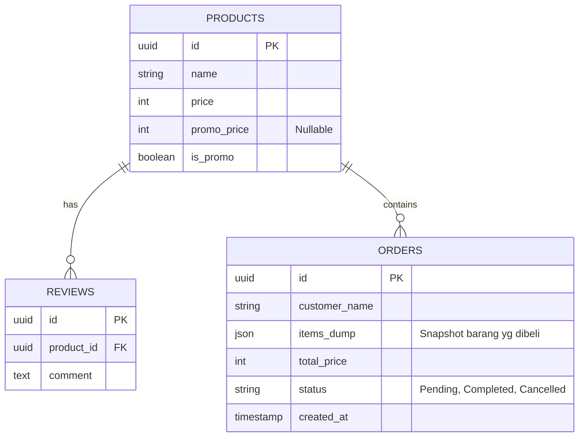

# PRD: Website Landing Page BUMDes Kalosi (Proker 1)

**Status:** Draft  
**Tanggal:** 28 Desember 2025  
**Referensi:** 
- `Proker KKN Desa Kalosi_ Website BUMDes & Perpustakaan.md` (Business Req)
- `Panduan Teknis Pengembangan Website Desa.md` (Technical Req)

## 1. Pendahuluan

### 1.1 Latar Belakang
BUMDes "Sumber Kalosi" memiliki berbagai unit usaha potensial (Kuliner, Wisata Malam, Mart) namun terkendala pemasaran digital. Transaksi saat ini masih manual dan bergantung pada jangkauan fisik. Diperlukan sebuah platform digital "BUMDes Landing Page" yang profesional untuk memperluas pasar dan mempermudah pemesanan.

### 1.2 Tujuan
- **Promosi Digital**: Menampilkan profil usaha, katalog kuliner, dan wahana wisata malam dengan visual yang menarik (*Wow Factor*).
- **Simplifikasi Transaksi**: Memungkinkan pemesanan produk melalui mekanisme "WhatsApp Checkout" tanpa perlu login atau *payment gateway* yang kompleks.
- **Modernisasi**: Menggantikan rencana penggunaan teknologi lama (WordPress) dengan stack modern (Next.js) sesuai panduan teknis terbaru untuk performa tinggi dan skalabilitas.

## 2. Target Pengguna (User Persona)

1.  **Masyarakat Lokal (Desa Kalosi & Sekitarnya)**
    *   *Need*: Memesan makanan (Nasi Goreng, Sarebba) atau kebutuhan galon/gas.
    *   *Behavior*: Menggunakan HP Android, internet kadang tidak stabil, terbiasa dengan WhatsApp.
2.  **Wisatawan Luar Desa**
    *   *Need*: Mencari informasi wisata malam (Istana Balon, Mobil Listrik).
    *   *Behavior*: Mencari via Google/Medsos, butuh info lokasi dan harga tiket yang jelas.
3.  **Admin BUMDes**
    *   *Need*: Menerima pesanan yang jelas (tidak perlu tanya ulang menu/alamat).

## 3. Spesifikasi Fungsional

### 3.1 Katalog Produk Interaktif
- **Kategori**: Kuliner (Food Court), Wisata Malam (Monalisa, Istana Balon), BUMDes Mart, Ketapang(Ikan).
- **Tampilan**: Grid responsif dengan foto kualitas tinggi.
- **Fitur Produk**:
    - Nama, Harga, Deskripsi.
    - Varian (misal: "Pedas", "Tidak Pedas" untuk Nasi Goreng).
    - Tombol "Tambah ke Keranjang".

### 3.2 Keranjang Belanja (Client-Side Cart)
- Menggunakan `react-use-cart` (Local Storage).
- Menyimpan item pilihan pengguna meski halaman di-refresh.
- Menampilkan Total Harga estimasi.

### 3.3 Checkout via WhatsApp & Order Logging
- **Formulir Checkout**: Nama, Alamat/Dusun (Dropdown), Catatan Tambahan.
- **Auto-Log to Database**:
    - Sebelum redirect ke WA, data pesanan DISIMPAN ke database sebagai `"Status: Pending"`.
    - Manfaat: Admin punya rekap data penjualan rapi, tidak hanya riwayat chat di WA.
- **Logic**: 
    - Save Order to DB -> Generate WA Link -> Redirect User.

### 3.4 Admin Dashboard (New)
- **Akses Terbatas**: Halaman `/admin` yang dilindungi dengan *Password* atau Otentikasi Sederhana.
- **Fitur CRUD**:
    - **Create**: Tambah menu/wahana baru (Upload foto, set harga, set harga promo).
    - **Read**: Lihat daftar produk dan **Riwayat Pesanan Masuk**.
    - **Update**: Ubah harga, stok, dan approve review.
    - **Delete**: Hapus menu.

### 3.5 Ulasan Pengguna (Guest Review)
- **Konsep**: Pengunjung bisa memberikan bintang (1-5) dan komentar pada produk tanpa login.
- **Proteksi**: Moderasi Admin (Status Pending).

### 3.6 Fitur Lanjutan (Saran Pengembangan Post-MVP)
1.  **QR Code Meja (Digital Menu)**: 
    - Admin bisa cetak QR Code untuk setiap meja kantin.
    - Pengunjung scan -> Buka Website -> Pesan tanpa antri di kasir.
2.  **PWA (Progressive Web App)**: 
    - Website bisa di-install di HP warga.
    - Bisa diakses offline (menu tersimpan di cache) saat sinyal buruk.
3.  **Promo & Diskon**:
    - Fitur "Harga Coret" untuk event tertentu (misal: Diskon Kemerdekaan).

### 3.7 Informasi & Navigasi
- **Hero Section**: Video/Slider suasana Wisata Malam.

## 4. Spesifikasi Teknis (Tech Stack)

Berdasarkan *Panduan Teknis Pengembangan Website Desa*:

- **Frontend**: Next.js (App Router).
- **Backend**: Self-Hosted PostgreSQL.
- **Deployment**: VPS.
- **Fitur Khusus**: `next-pwa` untuk dukungan offline mode.

### **4.1 Skema Database (Rancangan Awal)**

## 5. Roadmap Implementasi (Target KKN)

### Fase 1: Setup & Main Design (Minggu 1)
- Setup Project Next.js + Tailwind.
- Setup VPS (Install Docker, Nginx, Node.js).
- Desain Halaman Depan (Public).

### Fase 2: Admin Dashboard & CRUD (Minggu 2)
- Deploy Database PostgreSQL di VPS.
- Buat halaman Login Admin.
- Implementasi fitur CRUD Produk.

### Fase 3: Cart & WhatsApp Logic (Minggu 3)
- Integrasi `react-use-cart`.
- Finalisasi Logic WA Checkout.

### Fase 4: Polish & Deployment (Minggu 4)
- Setup Domain (DNS) ke IP VPS.
- Setup SSL (Certbot/Let's Encrypt).
- Input Data Real (Kuliner, Wisata, Ikan Ketapang).

## 6. Success Metrics
- Website dapat diakses < 3 detik (di jaringan 4G lokal).
- Fitur "Pesan via WA" berfungsi lancar (pesan terkirim ke HP Admin).
- Tampilan Visual "Wow" (Modern aesthetics).
