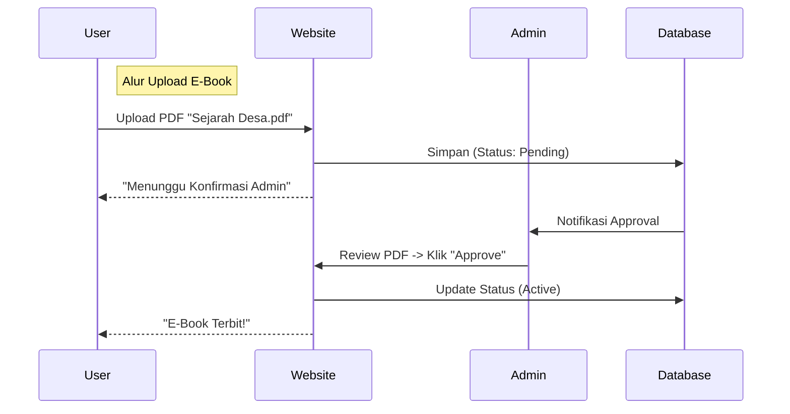
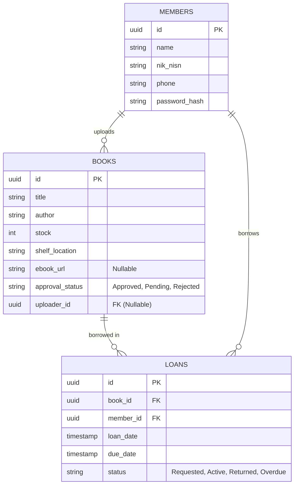

# PRD: Sistem Manajemen Perpustakaan Desa Kalosi (Proker 2)

**Status:** Draft  
**Tanggal:** 28 Desember 2025  
**Referensi:** 
- `diskusi.md` (User Request: "Website manajemen perpustakaan, bisa pinjam buku, bisa upload e-book")
- `Proker KKN Desa Kalosi...md` (Old Ref: SLiMS) -> *Upgraded to Custom Next.js*

## 1. Pendahuluan

### 1.1 Latar Belakang
Perpustakaan Desa Kalosi membutuhkan sistem digital untuk mengelola koleksi buku fisik dan menyediakan akses ke buku digital (e-book). Sistem ini akan menggantikan pencatatan manual dan meningkatkan minat baca warga melalui kemudahan akses.

### 1.2 Tujuan
- **Digitalisasi Koleksi**: Katalog online yang dapat diakses warga dari rumah.
- **Manajemen Sirkulasi**: Mencatat peminjaman dan pengembalian secara real-time.
- **Akses E-Book**: Platform untuk membaca dokumen/buku digital milik desa secara legal.
- **Kemandirian Teknologi**: Membangun sistem sendiri (Custom Build) menggunakan stack modern yang sama dengan Proker 1.

## 2. Target Pengguna

1.  **Warga/Siswa (Public User)**
    *   Mencari judul buku.
    *   Membaca E-book (PDF) online.
    *   Cek riwayat peminjaman sendiri.
2.  **Pustakawan (Admin)**
    *   Input data buku baru.
    *   Proses Peminjaman (Check-out) & Pengembalian (Check-in).
    *   Manajemen denda (opsional).

## 3. Spesifikasi Fungsional

### 3.1 Katalog & Pencarian (OPAC)
- **Search**: Cari berdasarkan Judul, Pengarang, Kategori.
- **Filter**: Ketersediaan (Tersedia/Dipinjam), Jenis (Fisik/E-book).
- **Detail Buku**: Menampilkan info lengkap dan Lokasi Rak.

### 3.2 Repositori E-Book (Crowdsourcing)
- **User Upload**: Warga dapat berkontribusi dengan mengunggah file PDF (misal: Skripsi, Karya Tulis, Koleksi Pribadi).
- **Moderasi (Approval Workflow)**:
    - E-book yang diunggah user masuk status **"Pending Review"**.
    - Admin menerima notifikasi -> Cek konten (SARA/Hoax/Copyright).
    - **Approve**: Masuk ke katalog publik.
    - **Reject**: Dihapus dan user diberi alasan.
- **PDF Viewer**: Integrasi `react-pdf` atau Native Viewer agar user bisa baca langsung di browser.

### 3.3 Manajemen Sirkulasi (Physical Book Request)
- **Fitur "Request Pinjam" (Baru)**:
    - User login -> Cari buku fisik -> Klik tombol "Ajukan Peminjaman".
    - Status buku di sistem menjadi "Booked/Requested" (tidak bisa dipinjam orang lain sementara waktu).
    - User datang ke kantor desa -> Admin verifikasi -> Admin ubah status jadi "Active Loan".
- **Sistem Keranjang Pinjam (Admin)**: Admin juga bisa input peminjaman langsung (Walk-in).
- **Due Date**: Sistem otomatis set tanggal kembali (misal: +7 hari).

### 3.4 Manajemen Anggota & Notifikasi
- Database Siswa/Warga.
- **Notifikasi WA (Opsional)**: Saat buku harus dikembalikan.

## 4. Spesifikasi Teknis (Tech Stack)

Disamakan dengan Proker 1 untuk efisiensi resource di VPS:

- **Frontend**: **Next.js (App Router)**.
- **UI Library**: **Tailwind CSS** (Shadcn/UI untuk Tabel Admin).
- **Database**: **PostgreSQL** (Self-Hosted di VPS yang sama).
- **PDF Engine**: `react-pdf` (Client Component).
- **Deployment**: VPS Ubuntu + Docker.

### **4.1 Alur "Request Pinjam" & "Upload" (User Flow)**

### **4.2 Skema Database (ERD)**

## 5. Roadmap Implementasi

### Fase 1: Database & Backend (Minggu 1)
- Desain Tabel (Books, Members, Loans).
- Setup API (via Server Actions / Route Handlers) untuk CRUD Buku.

### Fase 2: Katalog & E-Book (Minggu 2)
- Frontend Halaman Pencarian.
- Implementasi Upload & View PDF.

### Fase 3: Sirkulasi (Minggu 3)
- Halaman Admin untuk transaksi Peminjaman.
- Logika validasi stok buku.

### Fase 4: Integrasi & Deploy (Minggu 4)
- Deploy ke VPS (Subdomain: `pustaka.kalosi.desa.id`).
- Testing user flow.
